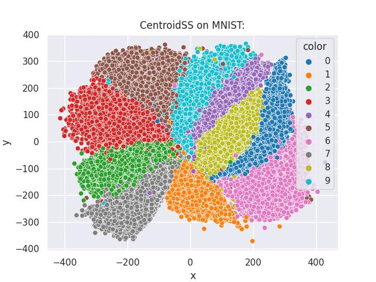

# ContrastiveLosses
Implementations and examples of use cases of loss functions used in contrastive representation learning.

Implemented in TensorFlow, orginally for use in genetic data, here shown for other applications as well.
### Computational Environment

#### Singularity:
The required packages are all included in the Apptainer definition file `image.def`.

Build the Apptainer image:

`$ sudo apptainer build  image.sif image.def`

Run the image, the --nv flag exposes the NVIDIA GPU to the container: 

`$ apptainer run --nv image.sif`

## Command line interface
The program `run_CL.py` is called for all implemented examples, at the time of writing MNIST and Cifar10.

To run, the user need to state whether we want to train a model anew or to plot already saved model states, which dataset to run, and where to save the logs. 

For example, to train a model on the MNIST dataset, execute the following:

`$ python3 -u run_CL.py train --data=mnist --dir=./test_mnist`

There is also an optional argument to restart training from a previously saved state, by appending the `--load_path=/path_to_saved_model` argument.

To plot results for saved model states in a directory and evaluate the KNN-classification accuracy, run 

`$ python3 -u run_CL.py plot --data=mnist --dir=./test_mnist`
Currently, this also runs PCA and t-SNE to compare with. Note that t-SNE may be relatively slow to run.

### Examples
#### MNIST
Within the singularity container running the example of contrastive learning on the MNIST dataset as described above for approximately 400 epochs, generates the following output: 

#### Fashion-MNIST

A similar dataset in size, but with clothing items instead is the Fashion-MNIST dataset. 

`$ python3 -u run_CL.py train --data=fashion_mnist --dir=./test_fashion_mnist`
The code yields the following results:

#### CIFAR10 (to be implemented)

#### Genetic data (to be implemented)
