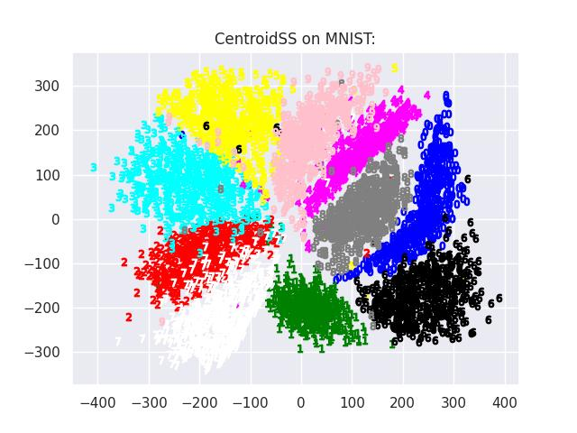

# ContrastiveLosses
Implementations and examples of use cases of loss functions used in contrastive representation learning.

Implemented in TensorFlow, orginally for use in genetic data, here shown for other applications as well.
### Computational Environment

#### Singularity:
The required packages are all included in the Apptainer definition file `image.def`.

Build the Apptainer image:

`$ sudo apptainer build  image.sif image.def`

Run the image: 

`$ apptainer run --nv image.sif`

### Examples
#### MNIST
Within the singularity container, run the python file `mnist.py`, to run an example of contrastive learning on the [MNIST dataset] [1]

`Singularity> python3 -u mnist.py`

Running the code for approximately 400 epochs, generates the following output: 

#### Genetic data (to be implemented)

#### CIFAR10 (to be implemented)

